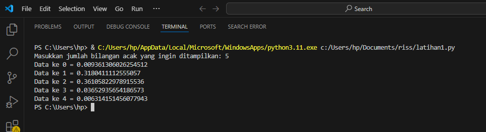
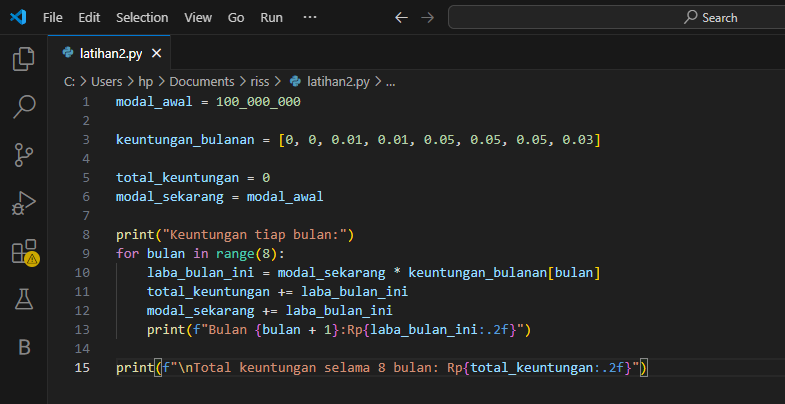
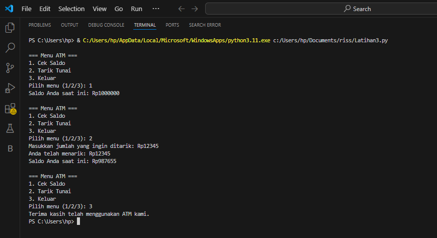

# labpy03
Nama
Nim
Kelas
Mata kuliah
## Bilangan acak
### Program python

### Hasil program

## Laba keuntungan
### Program python

### Hasil program

## ATM
### Program python

### Hasil program

